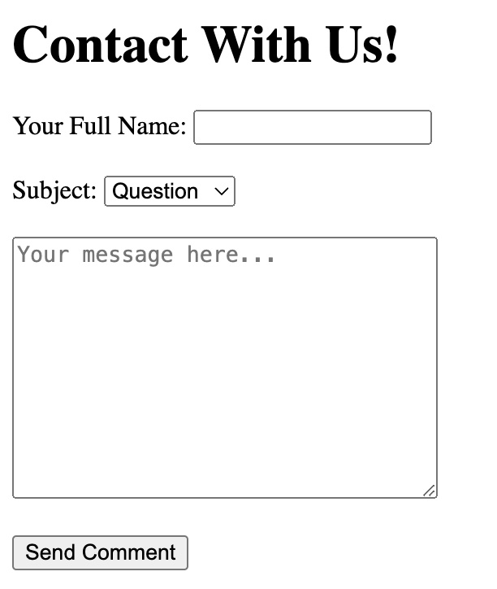
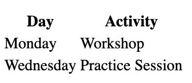
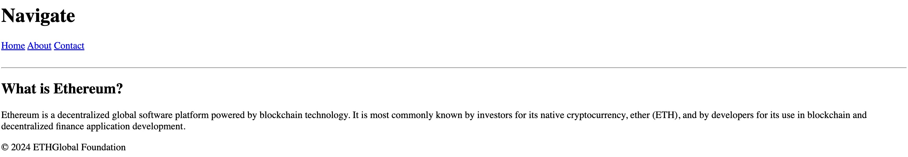
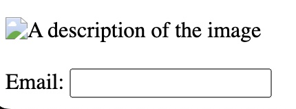

# **Week 1 / Workshop 2 / HTML Basics 2**

In this workshop, you will learn:
  - Form elements to capture user input.
  - Tables to display data in rows and columns.
  - Semantic HTML elements for better structure and accessibility.
  - Accessibility basics in HTML to improve user experience for all.

<br>

## Step 1: Forms and Inputs

In this step, you will use the following tags to create a simple contact form:

- **`<form>`:** Defines a form that collects user input.
- **`<input>`:** A versatile tag for different input fields (text, email, password, etc.).
  - Example: `<input type="text" placeholder="Enter your name">`
- **`<label>`:** A label that describes an input field, helping with accessibility.
  - Example: `<label for="name">Name:</label>`
- **`<button>`:** Defines a clickable button to submit the form.
  - Example: `<button type="submit">Submit</button>`
- **`<textarea>`:** Used for multiline text input.
  - Example: `<textarea placeholder="Enter your message"></textarea>`
- **`<select>` and `<option>`:** Used to create dropdown menus for selecting options.
  - Example:
    ```html
    <label for="subject">Subject:</label>
    <select id="subject">
      <option value="question">Question</option>
      <option value="feedback">Feedback</option>
    </select>
    ```

**Activity:** Create a contact form that includes name, email, message, and a dropdown for selecting the subject.

You should create a form that looks like this:



<br>

## Step 2: Tables

In this step, you will create a simple table to display a schedule:

- **`<table>`:** Defines the structure of a table.
- **`<tr>`:** Stands for "table row," used to define each row.
- **`<td>`:** Stands for "table data," defines a cell in the table.
- **`<th>`:** Stands for "table header," defines a header cell (usually bold and centered by default).

  Example:

  ````html
  <table>
    <tr>
      <th>Day</th>
      <th>Activity</th>
    </tr>
    <tr>
      <td>Monday</td>
      <td>Workshop</td>
    </tr>
    <tr>
      <td>Wednesday</td>
      <td>Practice Session</td>
    </tr>
  </table>
  ```` 
  
Your table should look like this now: 


  

## Step 3: Semantic HTML

In this step, we will explore Semantic HTML tags that help structure your webpage meaningfully:

- **`<header>`:** Defines the header section of a webpage. It typically contains the site's name or logo and navigation links.
- **`<nav>`:** Used to define a section that contains navigation links.
- **`<section>`:** Groups related content together in a section.
- **`<article>`:** Represents independent content such as blog posts or articles that can stand on their own.
- **`<footer>`:** Defines the footer section of a webpage, usually containing things like copyright information, links, and contact details.

Here is an example that incorporates semantic elements:

```html
<header>
  <h1>My Website</h1>
  <nav>
    <a href="#">Home</a>
    <a href="#">About</a>
    <a href="#">Contact</a>
  </nav>
</header>

<section>
  <article>
    <h2>Article Title</h2>
    <p>This is an article about something interesting.</p>
  </article>
</section>

<footer>
  <p>&copy; 2024 My Website</p>
</footer>
```

It will look like this: 


## Step 4: Accessibility Basics

Accessibility ensures that everyone, including people with disabilities, can use your website effectively. Here are a few key practices:

### 4.1. Alt Text for Images

Always include an `alt` attribute in your `` tags to describe the image content. This helps screen readers interpret the image for visually impaired users.

- **Example:**

    ```html
    
    ```

- The `alt` attribute provides a short description of the image content.

### 4.2. Form Labels

Always link `<label>` tags to their corresponding `<input>` elements using the `for` attribute. This ensures that users with assistive devices understand the relationship between labels and form fields.

- **Example:**

    ```html
    <label for="email">Email:</label>
    <input type="email" id="email">
    ```

- The `for` attribute in the `<label>` corresponds to the `id` attribute of the `<input>` field, creating an accessible relationship between the two.

### Why Accessibility Matters:

1. **Inclusive Design:** Ensures that your webpage can be accessed and used by people with disabilities.
2. **SEO Benefits:** Accessible websites often rank better in search engines.
3. **Legal Compliance:** Many countries require websites to be accessible under various laws and regulations.

It will look like this:



<br>

**🎉 Congratulations! You have successfully completed the Accessibility Basics activity!**
