# **Week 2 / Workshop 3 / CSS Basics 1**

In this workshop, you will learn the more intermediate concepts of the CSS and practice them by styling your

Tüm propertyler: https://www.w3schools.com/cssref/index.php
pseudo class: https://www.w3schools.com/css/css_pseudo_classes.asp

## Step 1: Intermediate CSS Properties

Here are a few essential and intermediate-level CSS properties you'll use to style your webpage:

- **1- Text Alignments:** Text alignment positions your text within its container.

  - 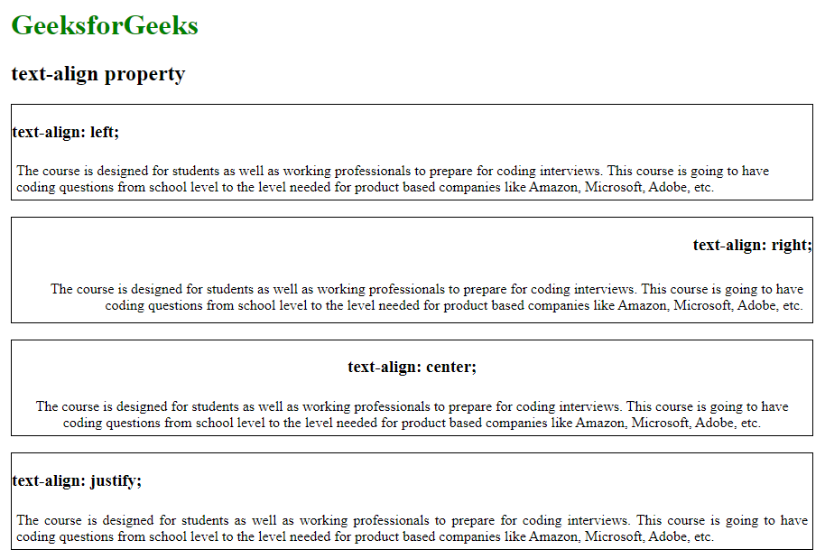

  - Examples:

    ```css
    h1 {
      text-align: center;
    }

    p {
      text-align: justify;
    }

    footer {
      text-align: right;
    }
    ```

  - Learn More:
    - W3Schools CSS Text Alignments: https://www.w3schools.com/css/css_text_align.asp

<br>
<br>

- **2- Fonts:** Fonts control the typography of your text, including the typeface, size, style and weight.

  - 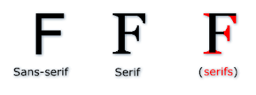
  - 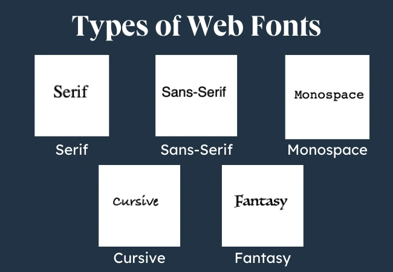

  - Examples:
    ```css
      body {
        font-family: Arial, sans-serif;
        font-size: 16px;
        font-weight: normal;
      }

      h1 {
        font-family: "Georgia", serif;
        font-size: 32px;
        font-weight: bold;
      }

      p {
        font-family: "Times New Roman", Times, serif;
        font-size: 14px;
        font-weight: lighter;
        font-style: italic;
      }
      ```

  - `font-family`: Defines the typeface used for text, like Arial, Times New Roman, etc. You can provide multiple options, with the browser choosing the first available one.
  - `font-style`: Specifies whether the text should be italic, oblique, or normal.
  - `font-weight`: Determines the thickness or boldness of the text, with values ranging from lighter (100) to bolder (900), or keywords like normal, bold.
  - `font-size`: Sets the size of the text, usually in units like pixels (px), em, rem, or percentage (%).

  - Learn More:
    - W3Schools CSS Font Family: https://www.w3schools.com/css/css_font.asp
    - W3Schools CSS Font Style: https://www.w3schools.com/css/css_font_style.asp
    - W3Schools CSS Font Size: https://www.w3schools.com/css/css_font_size.asp
    - W3Schools CSS Font Weight: https://www.w3schools.com/cssref/pr_font_weight.php

<br>
<br>

- **3- Position:** The position property in CSS specifies how an element is positioned in a document. It controls the layout and allows for more precise placement of elements. There are five main values:

  1. `static (default)`: The element is positioned according to the normal document flow.
  2. `relative`: The element is positioned relative to its original location in the document.
  3. `absolute`: The element is positioned relative to its nearest positioned ancestor or the document body if no ancestor is positioned.
  4. `fixed`: The element is positioned relative to the browser window and remains fixed even when scrolling.
  5. `sticky`: The element toggles between relative and fixed based on the user's scroll position.
     These values allow elements to be placed with more flexibility and control in web layouts.

  - 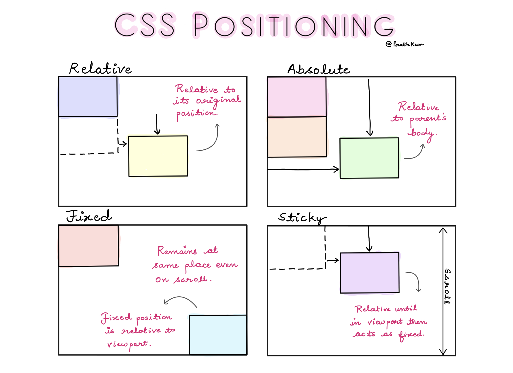

  - Examples:
      ```css
        /* START: Static Positioning (Default) */
        div {
          position: static;
          background-color: lightblue;
          padding: 20px;
        }
        /* END: Static Positioning (Default) */

        /* START: Relative Positioning */
        div {
          position: relative;
          top: 20px;
          left: 30px;
          background-color: lightgreen;
          padding: 20px;
        }
        /* END: Relative Positioning */

        /* START: Absolute Positioning */
        .container {
          position: relative;
          width: 300px;
          height: 200px;
          background-color: lightgray;
        }

        div {
          position: absolute;
          top: 10px;
          right: 10px;
          background-color: salmon;
          padding: 20px;
        }
        /* END: Absolute Positioning */
        ```

  - Learn More:
    - W3Schools CSS Position:

<br>
<br>

- **4- Z-Index:** The `z-index` property specifies the stack order of an element (which element should be placed in front of, or behind, the others).

  - 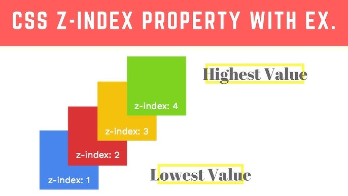

  - Examples:
    ```css
      div {
        position: absolute;
        z-index: 2;
      }

      img {
        position: absolute;
        z-index: 1;
      }
      ```

  - Learn More:
    - W3Schools CSS Z-Index: https://www.w3schools.com/css/css_z-index.asp

<br>
<br>

- **5- Align:** Aligning different elements requires using different properties in different ways.

  - Examples:

    ```css
    /* START: Center a block element */
    .center-div {
      margin: auto;
      width: 50%;
      border: 3px solid green;
      padding: 10px;
    }
    /* END: Center a block element */

    /* START: Center the text content of a block element */
    .center-content {
      text-align: center;
      border: 3px solid green;
    }
    /* END: Center the text content of a block element */

    /* START: Center the text directly */
    h1 {
      text-align: right;
    }
    /* END: Center the text directly */
    ```

  - Learn More:
    - W3Schools CSS Align: https://www.w3schools.com/css/css_align.asp

<br>
<br>

- **6- Overflow:** Controls how content is displayed when it overflows its container (e.g., hidden, scroll, or visible).

  - 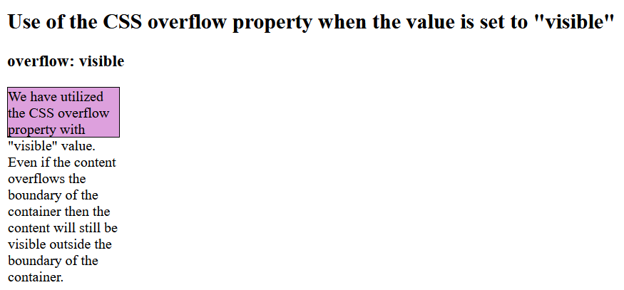
  - 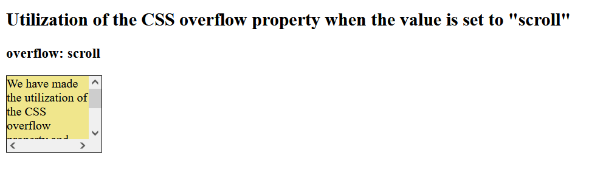

  - Examples:
    ```css
      div {
        width: 200px;
        height: 100px;
        overflow: scroll;
      }
      ```
  - Learn More:
    - W3Schools CSS Overflow: https://www.w3schools.com/css/css_overflow.asp

<br>
<br>

- **7- Box-Shadow:** Adds shadow effects around an element’s frame to give depth.

  - 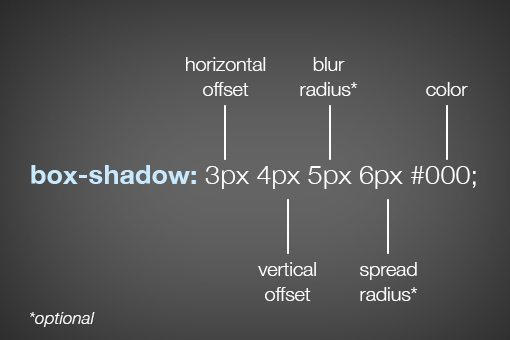

  - Examples:
    ```css
    div {
      box-shadow: 10px 10px 5px rgba(0, 0, 0, 0.5);
    }
    ```
  - Learn More:
    - W3Schools CSS Box Shadow: https://www.w3schools.com/css/css3_shadows_box.asp

<br>
<br>

- **8- `!important`:** Forces a style rule to override any other rule, even if it's more specific.

  - 

  - Examples:

    ```css
      p {
        color: red !important;
      }

      p {
        color: blue;
      }
      ```

  - Learn More:
    - W3Schools CSS `!important`: https://www.w3schools.com/css/css_important.asp

<br>
<br>

- **9- Table styling:** Customizing the appearance of HTML tables, including borders, spacing, and layout.

  - 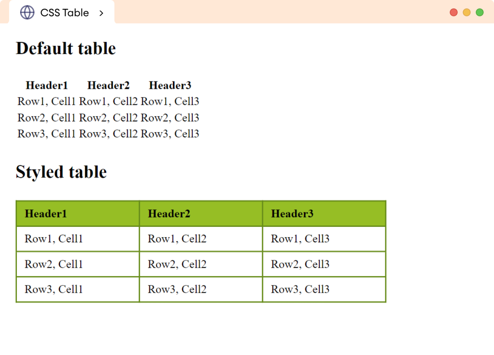

  - Examples:

    ```css
    table,
    th,
    td {
      border: 1px solid black;
      border-collapse: collapse;
    }

    th,
    td {
      padding: 15px;
      text-align: left;
    }
    ```

  - Learn More:
    - W3Schools CSS Table Styling: https://www.w3schools.com/css/css_table.asp

<br>
<br>

- **10- Pseudo Classes:** Applies styles to elements in specific states (e.g., `:hover`, `:focus`).

  - 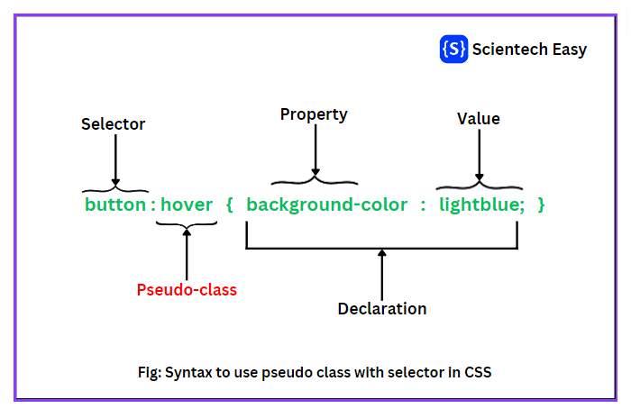
  - 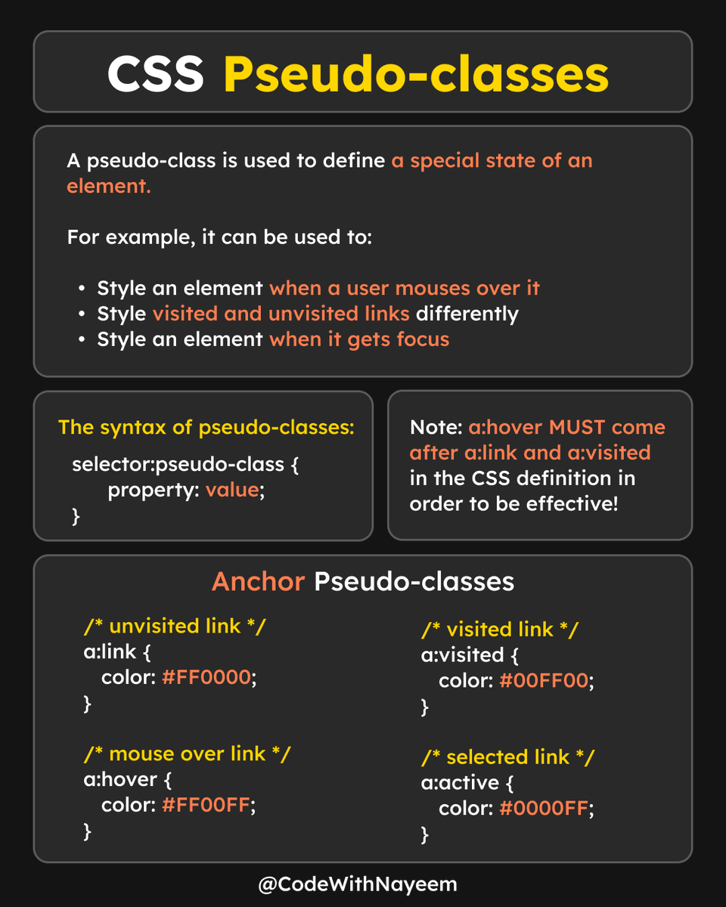

  Examples:

  - ```css
    a:hover {
      color: green;
    }

    p:focus {
      font-weight: bold;
    }
    ```

  - Learn More:
    - W3Schools CSS Pseudo-class: https://www.w3schools.com/css/css_pseudo_classes.asp

<br>
<br>

- **11- Display:** Determines how an element is displayed (e.g., `block`, `inline`, `none`).

  - 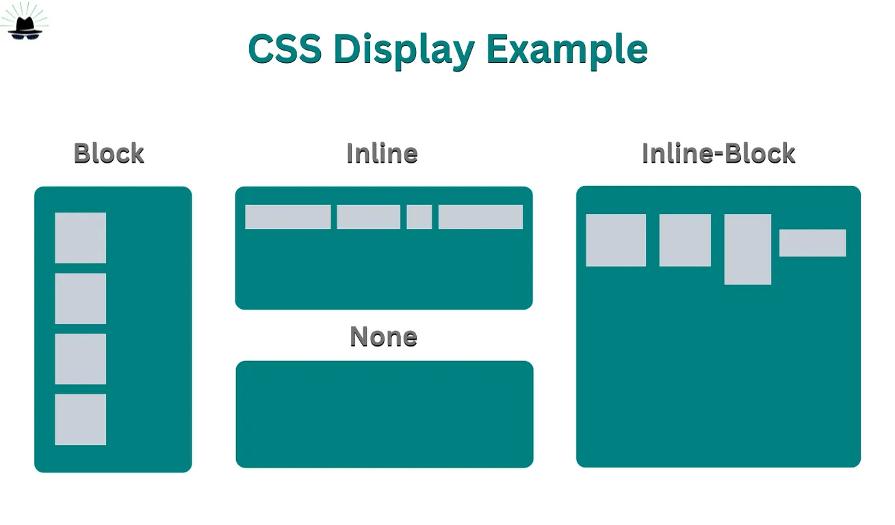
  - 

  Examples:

  - ```css
    div {
      display: flex;
    }

    p {
      display: inline;
    }
    ```

  - Learn More:
    - W3Schools CSS Display: https://www.w3schools.com/css/css_display_visibility.asp

<br>
<br>

- **12- Flexbox:** A layout model that arranges elements in a flexible and responsive manner along a row or column.

  - 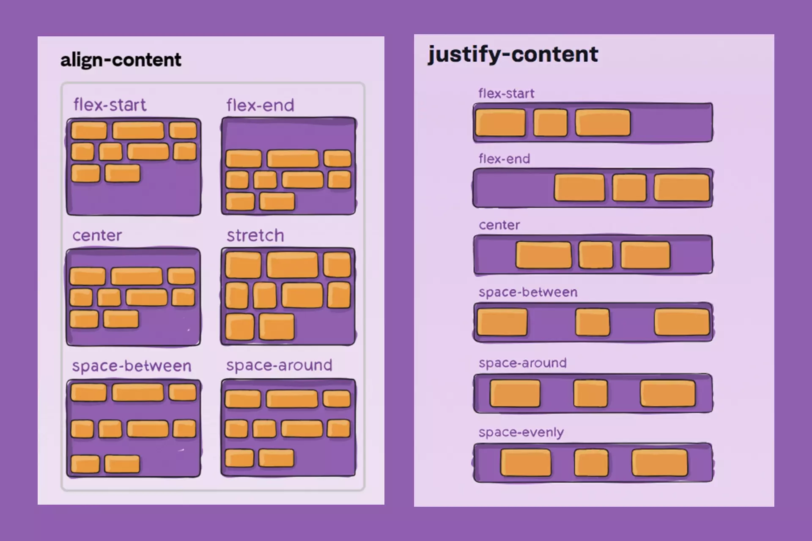 - `align-content` and `justify-content` explained

  - 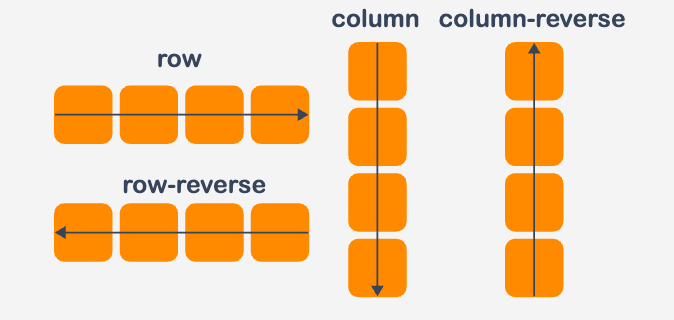 - `flex-direction` explained

  - Examples:
    ```css
        .container {
          display: flex;
          justify-content: space-between; /* Distributes items with space between them */
          align-items: center; /* Aligns items vertically in the center */
          flex-direction: row; /* Arranges items in a horizontal row */
        }

        .item {
          flex: 1; /* Each item will take up equal space */
          padding: 10px;
          background-color: lightblue;
          border: 1px solid #ccc;
          text-align: center;
        }
      ```

  - Learn More:
    - W3Schools CSS Flexbox: https://www.w3schools.com/css/css3_flexbox.asp
    - W3Schools CSS Flex Container: https://www.w3schools.com/css/css3_flexbox_container.asp

