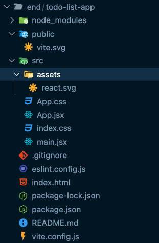

# **Week 3 / Workshop 6 / React Basics**

## Step 1: Introduction

### What is React? Why use React?

- React is a JavaScript library used for building user interfaces, especially single-page applications, because it allows for efficient rendering and a component-based approach that enhances code reusability and maintainability.

### Key Features of React:

- React's core features include a component-based architecture that promotes modular design, and the use of a virtual DOM that improves performance by minimizing direct interactions with the real DOM.

### Tools Required for React Development:

- To develop a React application, you will need Node.js and npm (Node Package Manager), which facilitate package management and provide a runtime environment for executing JavaScript code outside of the browser.

<br><br>

## Step 2: Setting Up React and Creating Your First Application

### Before Starting: Install Node.js

- Required minimum version: Node.js 18+ or 20+
- Download from: https://nodejs.org
- To verify installation, open terminal/command prompt and type:
  ```bash
      node --version
      npm --version
  ```

### Creating a React Application with `Vite`:

0. What is Vite and why to use it?

   - Vite is a modern, lightning-fast frontend build tool designed to enhance the developer experience, created by Evan You, the author of Vue.js. Unlike traditional bundlers, Vite relies on native ES module support in browsers, allowing for on-demand file serving and near-instant startup. This approach, combined with Hot Module Replacement (HMR), enables Vite to apply changes without reloading the page, providing instant feedback on code edits and making it ideal for fast development workflows. Vite also uses Rollup for optimized production builds, ensuring efficient code bundling, minification, and automatic code-splitting.

   - The benefits of Vite include its speed, simplicity, and support for modern JavaScript by default. It’s framework-agnostic, with support for React, Vue, Svelte, and more, and has an extensible plugin system compatible with Rollup plugins. With minimal configuration, developers get a fast, modular, and optimized build system that improves both development speed and production performance. Vite’s on-demand compilation and optimized builds make it a valuable tool for modern web projects, especially those requiring fast iteration and efficient code deployment.

1. Create a new React application using Vite by running the command `npm create vite@latest todo-list-app --template react`, which sets up a fast development environment tailored for React.

2. Run the following command to switch your directory:

   ```bash
       cd todo-list-app
   ```

   - `cd`: Stands for Change Directory

3. Run the following commands to install TailwindCSS:

   ```bash
     npm install -D tailwindcss postcss autoprefixer
     npx tailwindcss init -p
   ```

4. Configure the `tailwind.config.js` file as following:

   ```javascript
   // tailwind.config.js
   module.exports = {
     content: ["./index.html", "./src/**/*.{js,jsx,ts,tsx}"],
     theme: {
       extend: {},
     },
     plugins: [],
   };
   ```

5. Open `src/index.css` file and add the following codes to complete TailwindCSS setup:

   ```css
   /* src/index.css */
   @tailwind base;
   @tailwind components;
   @tailwind utilities;
   ```

6. Run the following command to install all node modules:

```bash
    npm install
```

7.  Run the following command to start the development server:

```bash
    npm run dev
```

### Let's Examine the Project Structure:

- 

### Understanding React Components:

## Step 3: Core Concepts of React

### 3.1. Components

- In React, components are the building blocks. Each component is a JavaScript function that returns a piece of UI.
- Example: A Greeting component

  ```javascript
  // src/components/Greeting.js
  import React from "react";

  function Greeting() {
    return <h1 className="text-2xl font-bold text-blue-600">Hello, World!</h1>;
  }

  export default Greeting;
  ```

- Explanation: The Greeting component returns an `<h1>` element styled with Tailwind classes. This component can be used anywhere in your app to display a greeting.

<br>
<br>
<br>

### 3.2. Rendering Components

- To see a component in action, render it inside your main app file.

  ```javascript
  // src/App.js
  import React from "react";
  import Greeting from "./components/Greeting";

  function App() {
    return (
      <div className="min-h-screen flex items-center justify-center bg-gray-100">
        <Greeting />
      </div>
    );
  }

  export default App;
  ```

- Explanation: Here, Greeting is rendered inside the App component, which acts as the main container of the app.

<br>
<br>
<br>

### 3.3. 'State' Term

- In React, state is an object that allows components to create, store, and manage dynamic data that can change over time. Unlike props, which are passed down from parent to child and are immutable (cannot be modified by the child component), state is managed within a component and can be updated. When the state of a component changes, React automatically re-renders the component to reflect the updated state, enabling interactive and responsive UI.

- **_Key Concepts of State in React:_**

  - **Component-Level Data:** State allows each component to maintain its own data. This data is typically unique to the component and changes based on user actions, API responses, or other factors.
  - **Mutability with setState:** While props are immutable, state is mutable. However, direct mutation of state (e.g., state.value = newValue) is not allowed. Instead, React provides a setState function to safely update the state and trigger a re-render.
  - **Encapsulation:** State is local to a component and can only be managed within that component unless shared explicitly with others. This makes state useful for encapsulating information that other components don’t need to access.
  - **Reactivity:** Changes in state are reactive, meaning that updating the state automatically triggers a re-render of the component, ensuring the UI reflects the latest data.

<br>
<br>
<br>

- Example 1: Basic State with `useState` Hook

  - React’s useState hook allows us to add state to functional components. Here’s a simple example of managing a counter using state.

  ```javascript
  import React, { useState } from "react";

  function Counter() {
    const [count, setCount] = useState(0); // Initialize state with default value 0

    return (
      <div>
        <p>Current count: {count}</p>
        <button onClick={() => setCount(count + 1)}>Increase</button>
      </div>
    );
  }

  export default Counter;
  ```

  - Explanation:
    - We use `useState(0)`, where `0` is the initial state value, to create a state variable `count` and a function `setCount` for updating it.
    - Every time the "Increase" button is clicked, `setCount(count + 1)` updates `count` by increasing its value by 1.
    - This update triggers a re-render, and the component displays the new `count` value.

<br>
<br>
<br>

- Example 2: Managing Complex State (Object State)

  - Sometimes, you might need to manage more complex data in the state, such as objects. Let’s say you’re building a user profile form where you need to manage multiple fields like `name` and `age`.

    ```javascript
    import React, { useState } from "react";

    function UserProfile() {
      const [profile, setProfile] = useState({
        name: "",
        age: "",
      });

      const handleInputChange = (e) => {
        const { name, value } = e.target;
        setProfile((prevProfile) => ({
          ...prevProfile,
          [name]: value,
        }));
      };

      return (
        <div>
          <input
            type="text"
            name="name"
            placeholder="Name"
            value={profile.name}
            onChange={handleInputChange}
          />
          <input
            type="number"
            name="age"
            placeholder="Age"
            value={profile.age}
            onChange={handleInputChange}
          />
          <p>
            Profile: {profile.name}, Age: {profile.age}
          </p>
        </div>
      );
    }

    export default UserProfile;
    ```

    - Explanation:
      - Here, `profile` is an object with `name` and `age` properties. We use `setProfile` to update these fields.
      - The `handleInputChange` function updates `profile` by spreading the current `profile` object with `...prevProfile` and changing only the target property (either `name` or `age`).
      - This keeps the state organized and allows us to manage multiple related fields in a single object.

<br>
<br>
<br>

- Example 3: Conditional Rendering Based on State

  - State can also control the visibility of components. Let’s create a simple Toggle component that shows and hides a message based on a button click.

    ```javascript
    import React, { useState } from "react";

    function ToggleMessage() {
      const [isVisible, setIsVisible] = useState(false);

      return (
        <div>
          <button onClick={() => setIsVisible(!isVisible)}>
            {isVisible ? "Hide" : "Show"} Message
          </button>
          {isVisible && <p>This is a toggled message!</p>}
        </div>
      );
    }

    export default ToggleMessage;
    ```

    - Explanation:
      - `isVisible` is a boolean state that determines if the message should be shown.
      - When the button is clicked, `setIsVisible(!isVisible)` toggles `isVisible` between `true` and `false`.
      - The `{isVisible && <p>This is a toggled message!</p>}` statement only renders the message if `isVisible` is `true`.
      - This use of state enables conditional rendering, a common pattern for building interactive UI elements.

### 3.4. 'Props' Term

- In React, props (short for "properties") are a way to pass data from a parent component to its child components. Props allow components to be dynamic and reusable by providing them with different input values each time they’re used. Props are immutable in the context of the component that receives them, meaning they cannot be changed by the child component that receives them.

- Example 1: Passing and Using Basic Props.

  ```javascript
  // src/components/Greeting.js
  function Greeting({ name }) {
    return <h1 className="text-2xl font-bold text-blue-600">Hello, {name}!</h1>;
  }

  // src/App.js
  function App() {
    return (
      <div className="min-h-screen flex items-center justify-center bg-gray-100">
        <Greeting name="Alice" />
        <Greeting name="Bob" />
      </div>
    );
  }
  ```

  - Explanation: The `Greeting` component now accepts a `name` prop, which is displayed in the UI. The parent `App` component passes "Alice" to it.

<br>
<br>
<br>

- Example 2: Passing Multiple Props: You can pass multiple props to a component to control various aspects of its rendering. Let’s create a `UserCard` component that takes in `name` and `age` as props.

  ```javascript
  // src/components/UserCard.js
  import React from "react";

  function UserCard({ name, age }) {
    return (
      <div className="user-card">
        <h2>Name: {name}</h2>
        <p>Age: {age}</p>
      </div>
    );
  }

  export default UserCard;
  ```

  - Explanation:
    - `UserCard` takes two props, `name` and `age`, and displays them in a simple card format.
    - Each prop is accessed individually after being destructured from the props object.
  - Using `UserCard` in `App`:

    ```javascript
    // src/App.js
    import React from "react";
    import UserCard from "./components/UserCard";

    function App() {
      return (
        <div>
          <UserCard name="Alice" age={25} />
          <UserCard name="Bob" age={30} />
        </div>
      );
    }

    export default App;
    ```

    - Explanation:
      - The `App` component passes different `name` and `age` values to each `UserCard`.
      - This flexibility in passing props allows `UserCard` to be used for any user without changing its internal code.

<br>
<br>
<br>

### 3.5. Conditional Rendering

- Conditional rendering in React allows you to show different UI elements or components based on certain conditions, like state or props values. React handles this similarly to JavaScript's conditional statements (e.g., `if`, `else`, `? :`, `&&`). Let’s go through the concept in depth with three examples of conditional rendering.

  - **_Basic if Statement for Conditional Rendering_**: In React, you can use a simple `if` statement to decide what to display based on a condition. Let’s say you want to display different messages based on a `loggedIn` state.

    ```javascript
    import React, { useState } from "react";

    function WelcomeMessage() {
      const [isLoggedIn, setIsLoggedIn] = useState(false);

      if (isLoggedIn) {
        return <p>Welcome back, user!</p>;
      } else {
        return <p>Please log in to continue.</p>;
      }
    }

    export default WelcomeMessage;
    ```

  - Explanation:

    - `isLoggedIn` is a state variable, initialized as `false`.
    - If `isLoggedIn` is `true`, the component renders "Welcome back, user!" Otherwise, it shows "Please log in to continue."
    - This `if-else` approach is direct but only works well if there are two specific outcomes to display.

<br>
<br>

- **_Using Ternary Operator for Inline Conditional Rendering_**: The ternary operator (`condition ? exprIfTrue : exprIfFalse`) is useful for inline conditions. This is ideal for simpler conditions where you want to switch between two elements without using multiple `return` statements.

  ```javascript
  import React, { useState } from "react";

  function StatusMessage() {
    const [status, setStatus] = useState("offline"); // status can be 'online' or 'offline'

    return (
      <div>
        <p>{status === "online" ? "You are online!" : "You are offline!"}</p>
        <button
          onClick={() => setStatus(status === "online" ? "offline" : "online")}
        >
          Toggle Status
        </button>
      </div>
    );
  }

  export default StatusMessage;
  ```

- Explanation:

  - `status` is set to `"offline"` initially.
  - Inside the `return` statement, a ternary condition checks if `status` is `"online"`. If true, it shows "You are online!"; otherwise, it displays "You are offline!"
  - The button toggles `status` between `"online"` and `"offline"`, demonstrating how conditional rendering updates in response to user interactions.

<br>
<br>

- **_Using Logical `&&` for Short-Circuit Conditional Rendering_**: If you want to conditionally display a component only if a condition is true, you can use the && operator. This is called short-circuit evaluation, where the second part only executes if the first part is true.

  ```javascript
  import React, { useState } from "react";

  function AdminPanel() {
    const [isAdmin, setIsAdmin] = useState(false);

    return (
      <div>
        <p>Welcome to the application!</p>
        {isAdmin && <button className="admin-btn">Access Admin Panel</button>}
        <button onClick={() => setIsAdmin(!isAdmin)}>
          {isAdmin ? "Logout Admin" : "Login as Admin"}
        </button>
      </div>
    );
  }

  export default AdminPanel;
  ```

- Explanation:

  - `isAdmin` state controls access to the admin panel.
  - `{isAdmin && <button className="admin-btn">Access Admin Panel</button>}` means that the "Access Admin Panel" button will only render if `isAdmin` is `true`.
  - The toggle button switches `isAdmin` between `true` and `false`, effectively showing or hiding the admin button based on the user’s role.

<br>
<br>
<br>

### 3.6. Lists and Keys

- React uses keys to efficiently manage lists of elements.
- Example: Render a list of items.
  ```javascript
  function ItemList({ items }) {
    return (
      <ul className="list-disc pl-5 space-y-2">
        {items.map((item, index) => (
          <li key={index} className="text-gray-700">
            {item}
          </li>
        ))}
      </ul>
    );
  }
  ```
  - Explanation: The `ItemList` component maps over `items`, displaying each item. The `key` prop helps React track elements efficiently.

<br>
<br>
<br>

### 3.7. Hooks

- In React, Hooks are functions that allow you to use state and other React features in functional components. Introduced in React 16.8, Hooks enable us to use features like state management, lifecycle methods, and more without needing to write class components. The two most commonly used hooks are `useState` for managing state and `useEffect` for handling side effects, but there are many others, including `useContext`, `useReducer`, and custom hooks.

- **`useState` Hook**: The `useState` Hook allows you to add and manage state in a functional component. It takes the initial state as an argument and returns an array containing the current state and a function to update it.

  ```javascript
  import React, { useState } from "react";

  function Counter() {
    // Declare a state variable 'count' with an initial value of 0
    const [count, setCount] = useState(0);

    return (
      <div>
        <p>Current Count: {count}</p>
        <button onClick={() => setCount(count + 1)}>Increase Count</button>
      </div>
    );
  }

  export default Counter;
  ```

- **`useEffect` Hook**: The `useEffect` Hook allows you to perform side effects in functional components, such as data fetching, subscribing to data streams, or manually modifying the DOM. It takes a callback function that React calls after every render. The second argument, an optional dependency array, determines when the effect runs.

  ```javascript
  import React, { useState, useEffect } from "react";

  function Timer() {
    const [seconds, setSeconds] = useState(0);

    // Effect to update seconds every 1 second
    useEffect(() => {
      const intervalId = setInterval(() => {
        setSeconds((prevSeconds) => prevSeconds + 1);
      }, 1000);

      // Cleanup function to clear interval on component unmount
      return () => clearInterval(intervalId);
    }, []); // Empty dependency array means this runs once on mount

    return (
      <div>
        <p>Elapsed Time: {seconds} seconds</p>
      </div>
    );
  }

  export default Timer;
  ```

  - Explanation:
    - `useEffect` is used to set up a timer that increments the `seconds` state variable every second.
    - `setInterval` starts a timer, and `clearInterval` is used in the cleanup function to prevent memory leaks when the component is unmounted.
    - The empty dependency array `[]` makes this effect run only once when the component mounts, 'as' there are no dependencies that would trigger re-runs.
